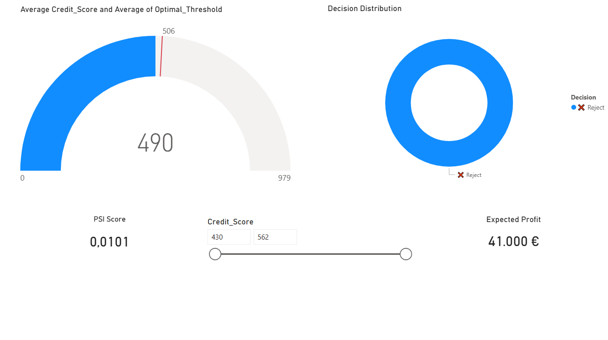

# Credit Risk Scoring System
An end-to-end Credit Risk Scoring system using Logistic Regression and Power BI to optimize bank profitability.
# Credit Risk Scoring & Profit Optimization System

## 📌 Project Overview
This project presents an end-to-end **Credit Risk Scoring System** designed to evaluate loan applicants and maximize bank profitability.

## 🚀 Key Implementation Stages
* **Machine Learning Modeling:** Trained a **Logistic Regression** model to predict Probability of Default (PD).
* **Credit Scorecard:** Converted probabilities into a standard **300–850** range.
* **Profit Optimization:** Identified an **Optimal Threshold of 506**, maximizing expected profit at **41,000€ **.
* **Stability:** Achieved a **PSI of 0.0101**, indicating a highly stable model.

## 📊 Dashboard Preview

